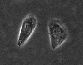

# Level Set Image Segmentation using Python

## Introduction

This python code implements a new level set formulation, called distance regularized level set evolution (DRLSE), proposed by 
**Chunming Li et al's** in the paper ["Distance Regularized Level Set Evolution and its Application to Image Segmentation", 
IEEE Trans. Image Processing, vol. 19 (12), 2010](http://ieeexplore.ieee.org/stamp/stamp.jsp?arnumber=5557813 "Link to the original paper")

The main advantages of DRLSE over conventional level set formulations include the following:
1) It completely eliminates the need for reinitialization
2) It allows the use of large time steps to significantly speed up curve evolution, while ensuring numerical accuracy
3) Very easy to implement and computationally more efficient than conventional level set formulations.
<br></br>

This package only implements an edge-based active contour model as one application of DRLSE.
More applications of DRLSE can be found in other published papers in the following website:

http://www.imagecomputing.org/~cmli/

I tried very hard to explain everything in the code. If you still struggle, please Email me: rsoft.ramesh@gmail.com

## Requirements

Program was tested in `python 3.7`. But it should work on any python 3.x release. In addition, the following packages needs to be there in your python environment to following algorithm to work. This algorithm was tested with the following version of the packages.

```
numpy>=1.18
scipy>=1.4
matplotlib>=3.3
scikit-image>=0.17
```

You can install the required packages using `pip`.

```bash
pip install numpy scipy matplotlib scikit-image
```

## Configuration

In order to get the correct output from the input image, there are lots of parameters that is needed to be fine tuned. In the code, I have configured the parameters for `gourd.bmp` and 'twocells.bmp` images.

A sample set of parameter is given below.

```python
    params = {
        'img': img,  # image input
        'initial_lsf': initial_lsf,  # initial LSF array of same size as the image
        'timestep': 5,  # time step
        'iter_inner': 5,
        'iter_outer': 40,  # drlse will run for iter_inner * iter_outer number of iterations (see the code for more info)
        'lmda': 5,  # coefficient of the weighted length term L(phi)
        'alfa': 1.5,  # coefficient of the weighted area term A(phi)
        'epsilon': 1.5,  # parameter that specifies the width of the DiracDelta function
        'sigma': 1.5,  # scale parameter in Gaussian kernel
        'potential_function': DOUBLE_WELL,  # SINGLE_WELL or DOUBLE_WELL (see the code for more info)
    }
```

## Execution

You can run the project using the following commands:

```bash
python -m lv_set.Main
```

## Results

| Image | Contour |  Grid |
|----------|:-------------:|------:|
|  |   |  |
|  |   |  |
|  |   |  |
